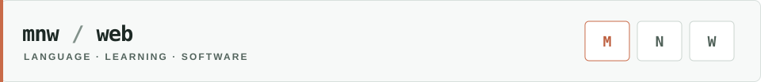

# Tao Mon Lae

**Full-stack web developer** · Mon, Myanmar → Kuala Lumpur, Malaysia

I build software for learning and language: classroom tools, multilingual web apps, and ways to type and find Mon (mnw) text.

### Selected work

- **[MRLC LMS](https://github.com/TaoMonLae/mrlc-lms)** — A learning and school operations platform for the Mon Refugee Learning Centre, built with React, Express, PostgreSQL, and Prisma.
- **[Yamu](https://github.com/TaoMonLae/yamu)** — A Mon, Burmese, and English name index with multilingual search and spelling variants, built with Next.js.
- **[Lucky Draw Pro](https://github.com/TaoMonLae/lucky-draw-pro)** — A live raffle app with audience views, session history, and export tools.
- **Mon keyboards** — Mon input tools for [Linux](https://github.com/TaoMonLae/mon_keyboard_linux) and [macOS](https://github.com/TaoMonLae/macOS-MonUnicode-Keyboard).

### Toolkit

`TypeScript` · `React` · `Next.js` · `Node.js` · `Express` · `PostgreSQL` · `Prisma` · `Cloudflare Workers`

I also [contribute Mon translations to Ubuntu](https://launchpad.net/~htetminaung2018).
